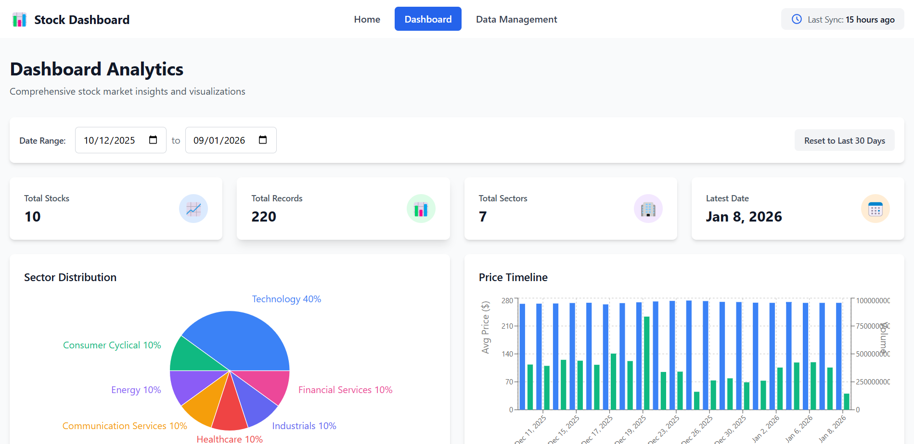
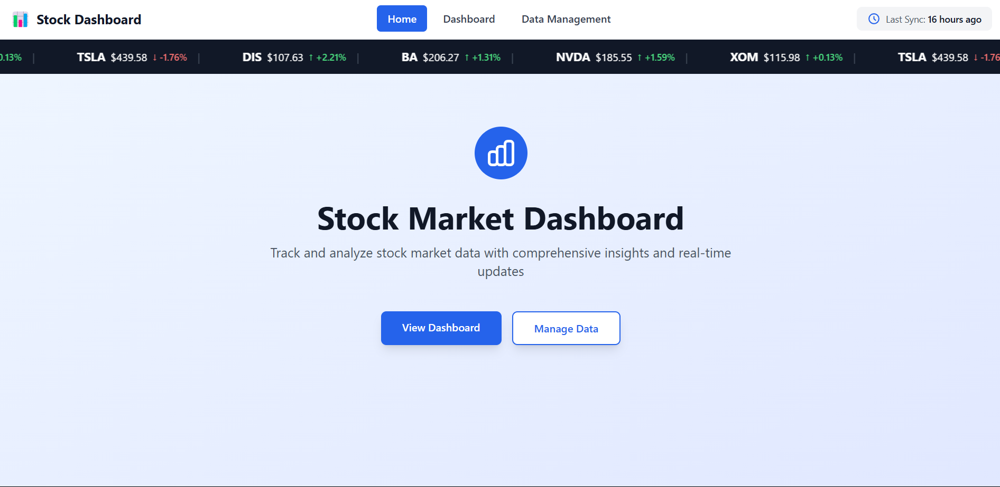
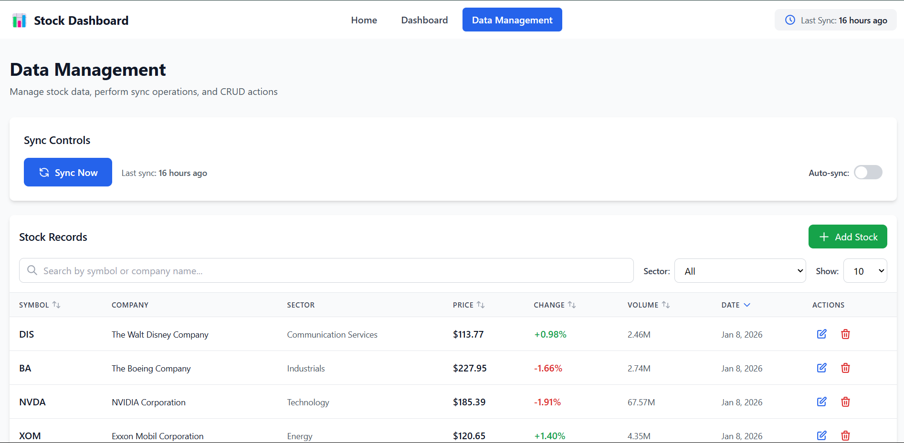
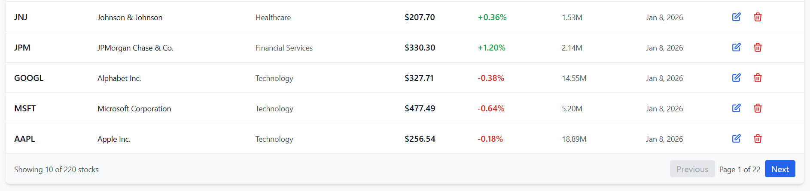
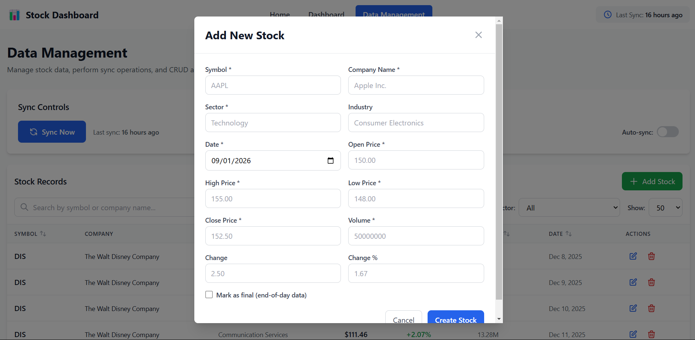
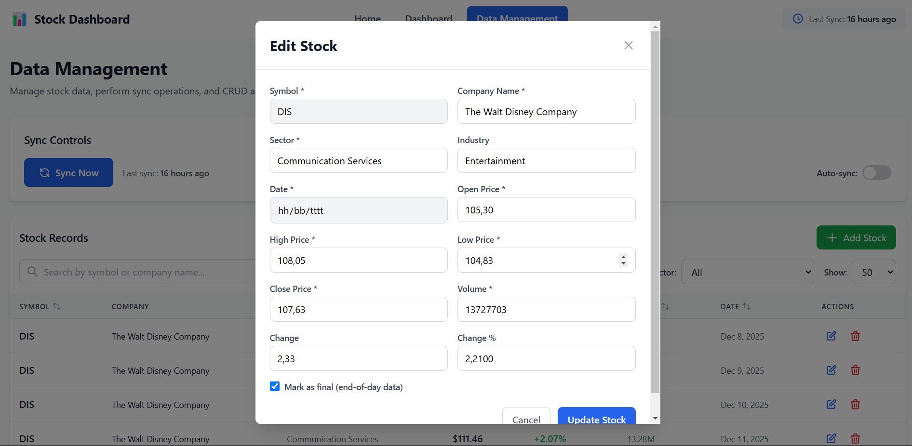
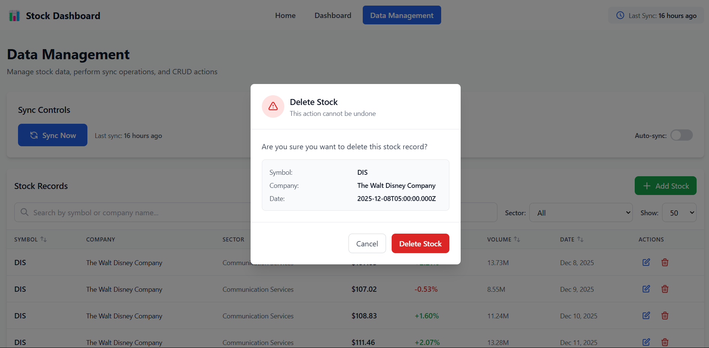

# Stock Market Dashboard

A full-stack web application for tracking and analyzing stock market data with real-time synchronization capabilities using Financial Modeling Prep (FMP) as a public api. Built with React, Node.js, Express, and PostgreSQL.


---

## 🌟 Features


### 📈 Dashboard Analytics



- **Real-time Statistics** - View total stocks, records, sectors, and latest sync date
- **Interactive Charts** - Pie chart for sector distribution and column chart for price timeline
- **Date Range Filtering** - Filter data by custom date ranges
- **Auto-refresh** - Dashboard automatically refreshes every 30 seconds

### 🔄 Data Synchronization



- **Manual Sync** - Trigger data synchronization on-demand
- **Auto-sync** - Configurable automatic synchronization (5/10/15/30 minute intervals)
- **Countdown Timer** - Visual countdown for next auto-sync
- **Success Indicators** - Animated checkmark on successful sync
- **Error Handling** - Auto-pause on sync errors with detailed messages

### 📊 Data Management










- **CRUD Operations** - Create, read, update, and delete stock records
- **Advanced Search** - Search by symbol or company name
- **Filter & Sort** - Filter by sector, sort by any column
- **Pagination** - Navigate through large datasets efficiently
- **Stock Ticker** - Scrolling ticker showing latest stock prices

### 🎨 User Interface
- **Responsive Design** - Clean, professional blue-themed interface
- **Three-page Structure** - Landing, Dashboard, and Management pages
- **Toast Notifications** - User-friendly success/error messages
- **Loading States** - Smooth loading indicators
- **Form Validation** - Client-side and server-side validation

---

## 🛠️ Tech Stack

### Backend
- **Node.js** (v20) - JavaScript runtime
- **Express.js** - Web framework
- **PostgreSQL** (v16) - Relational database
- **Axios** - HTTP client for FMP API integration
- **node-postgres (pg)** - PostgreSQL client

### Frontend
- **React** (v18.2) - UI library
- **Vite** - Build tool and dev server
- **React Router DOM** - Client-side routing
- **Tailwind CSS** - Utility-first CSS framework
- **Recharts** - Chart library for data visualization
- **Axios** - HTTP client for backend API calls

### DevOps
- **Docker** - Containerization
- **Docker Compose** - Multi-container orchestration

---

## 📁 Project Structure

```
US-Stock-Market-Analytics-Website/
├── backend/                   # Backend API (Node.js + Express)
│   ├── src/
│   │   ├── config/            # Database & constants configuration
│   │   ├── controllers/       # Request handlers
│   │   ├── models/            # Database operations
│   │   ├── routes/            # API endpoint definitions
│   │   ├── services/          # Business logic & FMP API integration
│   │   ├── utils/             # Helper functions & validators
│   │   ├── middleware/        # Error handling middleware
│   │   └── app.js             # Express application entry point
│   ├── migrations/            # Database schema migrations
│   ├── package.json
│   ├── Dockerfile
│   └── .env.example
│
├── frontend/                   # Frontend (React + Vite)
│   ├── src/
│   │   ├── components/
│   │   │   ├── common/        # Navbar, StockTicker, Loader, Toast
│   │   │   ├── dashboard/     # Stats, Charts, DatePicker
│   │   │   └── management/    # SyncControls, Table, Modals
│   │   ├── pages/             # Landing, Dashboard, Management
│   │   ├── services/          # API client (axios)
│   │   ├── utils/             # Formatters, constants
│   │   ├── App.jsx
│   │   ├── main.jsx
│   │   └── index.css
│   ├── public/
│   ├── package.json
│   ├── Dockerfile
│   ├── tailwind.config.js
│   ├── postcss.config.js
│   ├── vite.config.js
│   └── .env.example
│
├── docker-compose.yml
├── README.md
├── .gitignore
├── Makefile
└── setup.sh
```

---

## 🚀 Getting Started

### Prerequisites

- **Docker** (v20.10 or higher)
- **Docker Compose** (v2.0 or higher)
- **FMP API Key** (Free tier available at [financialmodelingprep.com](https://site.financialmodelingprep.com/))

### Installation

1. **Clone the repository**
   ```bash
   git clone <repository-url>
   cd US-Stock-Market-Analytics-Website
   ```

2. **Set up Environment**
   ```bash
   ./setup.sh
   ```
   
   Edit `backend/.env` and add your FMP API key:
   ```env
   DATABASE_HOST=db
   DATABASE_PORT=5432
   DATABASE_NAME=stock_dashboard
   DATABASE_USER=postgres
   DATABASE_PASSWORD=postgres123
   FMP_API_KEY=your_actual_fmp_api_key_here
   PORT=5000
   NODE_ENV=development
   TZ=America/New_York
   STOCK_SYMBOLS=AAPL,MSFT,GOOGL,JPM,JNJ,TSLA,XOM,NVDA,BA,DIS
   ```

3. **Start the Application**
   ```bash
   cd ..
   docker-compose up -d
   ```

4. **Verify Services are Running**
   ```bash
   docker-compose ps
   ```
   
   All three services (db, backend, frontend) should be "Up".

5. **Initialize Database with Stock Data**
   ```bash
   # Trigger initial sync to populate database
   curl -X POST http://localhost:5000/api/sync \
     -H "Content-Type: application/json" \
     -d '{}'
   ```
   
   This will fetch historical data (1 month) for all 10 stocks. Takes ~30-60 seconds.

6. **Access the Application**
   - Frontend: [http://localhost:5173](http://localhost:5173)
   - Backend API: [http://localhost:5000](http://localhost:5000)
   - API Health: [http://localhost:5000/health](http://localhost:5000/health)

---

## 📡 API Endpoints

### Stock Management
```
GET    /api/stocks              # List all stocks (with filters, pagination)
GET    /api/stocks/:id          # Get single stock by ID
POST   /api/stocks              # Create new stock record
PUT    /api/stocks/:id          # Update stock record
DELETE /api/stocks/:id          # Delete stock record
```

### Dashboard Analytics
```
GET    /api/stocks/dashboard/stats              # Get dashboard statistics
GET    /api/stocks/dashboard/sector-distribution # Get sector distribution data
GET    /api/stocks/dashboard/price-timeline      # Get price timeline data
```

### Synchronization
```
POST   /api/sync                # Trigger sync (auto-detects initial/regular)
POST   /api/sync/initial        # Force initial sync
GET    /api/sync/logs           # Get sync history
GET    /api/sync/last           # Get last sync timestamp
GET    /api/sync/stats          # Get sync statistics
```

---

## 🗄️ Database Schema

### `stocks` table
```sql
CREATE TABLE stocks (
  id SERIAL PRIMARY KEY,
  symbol VARCHAR(10) NOT NULL,
  company_name VARCHAR(255) NOT NULL,
  sector VARCHAR(100),
  industry VARCHAR(100),
  open_price DECIMAL(12, 4) NOT NULL,
  high_price DECIMAL(12, 4) NOT NULL,
  low_price DECIMAL(12, 4) NOT NULL,
  close_price DECIMAL(12, 4) NOT NULL,
  volume BIGINT NOT NULL,
  change DECIMAL(12, 4) DEFAULT 0,
  change_percent DECIMAL(10, 4) DEFAULT 0,
  date DATE NOT NULL,
  is_final BOOLEAN DEFAULT FALSE,
  created_at TIMESTAMP DEFAULT NOW(),
  updated_at TIMESTAMP DEFAULT NOW(),
  UNIQUE(symbol, date)
);
```

### `sync_logs` table
```sql
CREATE TABLE sync_logs (
  id SERIAL PRIMARY KEY,
  sync_type VARCHAR(20) NOT NULL,
  records_synced INTEGER DEFAULT 0,
  status VARCHAR(20) NOT NULL,
  error_message TEXT,
  synced_at TIMESTAMP DEFAULT NOW()
);
```

---

## 🔧 Development

### Running Backend Locally
```bash
cd backend
npm install
npm run dev
```
Backend will start on [http://localhost:5000](http://localhost:5000)

### Running Frontend Locally
```bash
cd frontend
npm install
npm run dev
```
Frontend will start on [http://localhost:5174](http://localhost:5174) (port 5173 if available)

### Database Access
```bash
# Access PostgreSQL CLI
docker exec -it stock-dashboard-db psql -U postgres -d stock_dashboard

# Run queries
SELECT COUNT(*) FROM stocks;
SELECT * FROM sync_logs ORDER BY synced_at DESC LIMIT 5;
```

### View Logs
```bash
# All services
docker-compose logs -f

# Specific service
docker-compose logs -f backend
docker-compose logs -f frontend
docker-compose logs -f db
```

---

## 🧪 Testing

### Backend Tests
```bash
# Health check
curl http://localhost:5000/health

# Get stocks
curl http://localhost:5000/api/stocks | jq

# Dashboard stats
curl http://localhost:5000/api/stocks/dashboard/stats | jq

# Trigger sync
curl -X POST http://localhost:5000/api/sync \
  -H "Content-Type: application/json" \
  -d '{}'
```

### Frontend Tests
1. Open [http://localhost:5173](http://localhost:5173)
2. Navigate through:
   - Landing page
   - Dashboard (view charts and stats)
   - Management page (test CRUD operations)
3. Try features:
   - Search stocks
   - Filter by sector
   - Sort columns
   - Add/Edit/Delete stock
   - Enable auto-sync
   - Change date range

---

## 🎯 Key Features Explained

### Sync Mechanism
The application uses a hybrid sync strategy:

1. **Initial Sync** - Fetches 1 month of historical EOD (End of Day) data for all stocks
2. **Regular Sync** - Uses batch quote API to update with latest prices
3. **Auto-finalize** - Marks data as final after market close (5 PM EST)

### API Efficiency
- Uses **batch API calls** (1 call for all 10 stocks instead of 10 separate calls)
- Implements **database indexing** for fast queries
- **Pagination** to handle large datasets
- **Caching** with auto-refresh intervals

### User Experience
- **Optimistic UI updates** for instant feedback
- **Toast notifications** for all operations
- **Loading states** to indicate progress
- **Error boundaries** for graceful error handling

---

## 📊 Tracked Stocks

The application tracks these 10 stocks by default:
- **AAPL** - Apple Inc.
- **MSFT** - Microsoft Corporation
- **GOOGL** - Alphabet Inc.
- **JPM** - JPMorgan Chase & Co.
- **JNJ** - Johnson & Johnson
- **TSLA** - Tesla, Inc.
- **XOM** - Exxon Mobil Corporation
- **NVDA** - NVIDIA Corporation
- **BA** - The Boeing Company
- **DIS** - The Walt Disney Company

You can modify the tracked stocks by editing `STOCK_SYMBOLS` in `backend/.env`.

---

## 🔒 Environment Variables

### Backend (`backend/.env`)
| Variable | Description | Default |
|----------|-------------|---------|
| `DATABASE_HOST` | PostgreSQL host | `db` |
| `DATABASE_PORT` | PostgreSQL port | `5432` |
| `DATABASE_NAME` | Database name | `stock_dashboard` |
| `DATABASE_USER` | Database user | `postgres` |
| `DATABASE_PASSWORD` | Database password | `postgres123` |
| `FMP_API_KEY` | Financial Modeling Prep API key | *Required* |
| `PORT` | Backend server port | `5000` |
| `NODE_ENV` | Environment | `development` |
| `TZ` | Timezone | `America/New_York` |
| `STOCK_SYMBOLS` | Comma-separated stock symbols | See above |

### Frontend (`frontend/.env`)
| Variable | Description | Default |
|----------|-------------|---------|
| `VITE_API_URL` | Backend API URL | `http://localhost:5000/api` |
| `VITE_APP_NAME` | Application name | `Stock Dashboard` |

---

## 🐛 Troubleshooting

### Database Connection Error
```bash
# Restart database
docker-compose restart db

# Check database logs
docker-compose logs db

# Verify database is accessible
docker exec -it stock-dashboard-db psql -U postgres -c "SELECT 1"
```

### Frontend Not Loading
```bash
# Check if Tailwind CSS is installed
docker-compose exec frontend ls node_modules | grep tailwindcss

# Rebuild frontend
docker-compose down
docker-compose build --no-cache frontend
docker-compose up -d
```

### API Calls Failing
```bash
# Check backend logs
docker-compose logs backend

# Verify backend is running
curl http://localhost:5000/health

# Check CORS configuration
```

### FMP API Limit Reached
- Free tier: 250 calls/day
- Check usage at [FMP Dashboard](https://site.financialmodelingprep.com/developer/docs)
- Reduce sync frequency or upgrade plan

---

## 👨‍💻 Author

**Hanif Kalyana Aditya**

[Email](hanifaditya2304@gmail.com) |
[LinkedIn](https://www.linkedin.com/in/hanifaditya/) |
[Website](https://hanifaditya.netlify.app/)

---

## 🙏 Acknowledgments

- [Financial Modeling Prep](https://site.financialmodelingprep.com/) for stock market data API
- [Recharts](https://recharts.org/) for beautiful React charts
- [Tailwind CSS](https://tailwindcss.com/) for utility-first styling
- [Heroicons](https://heroicons.com/) for UI icons

---

## 📞 Support

For issues, questions, or contributions:
1. Check existing documentation
2. Review logs: `docker-compose logs`
3. Verify environment variables
4. Check API key validity

---

## 🚀 Future Enhancements

Potential features for future development:
- [ ] User authentication and authorization
- [ ] Real-time WebSocket updates
- [ ] Mobile responsive design
- [ ] More chart types (candlestick, area)
- [ ] Stock comparison feature
- [ ] Email notifications for price alerts
- [ ] Portfolio management
- [ ] Historical performance analytics

---